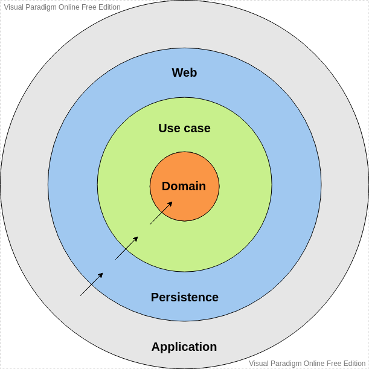

# PROMEL API

## Pré requisitos
- Java Development Kit 11 ou superior;
- MySQL 8;
- Ambiente Docker para execução dos testes de integração.

## Estrutura do projeto
O projeto usa como arquitetura as práticas de [Clean Architecture](https://8thlight.com/blog/uncle-bob/2012/08/13/the-clean-architecture.html) objetivando o desenvolvimento de um código fácilmente testável, com modulos de baixo acoplamento e que suporte a inclusão de novas funcionalidades de forma eficiente.

O projeto está dividido nos seguintes módulos:
* `domain`: Possui todos os objetos de domínio da aplicação;
* `usecases`: Possui toda a regra de negócio do serviço;
* `persistence`: Implementação da camada de dados onde são implementadas as interfaces de acesso a dados definidas pela camada de caso de uso;
* `web`: Camada que expõe os endpoints da API como um serviço web;
* `application`: Módulo que interliga todos os outros módulos da arquitetura e inicia a aplicação.

### Diagrama de dependências entre os módulos

### Security
A implementação atual do projeto utiliza o Spring Security juntamente com uma implementação de autenticação usando JWT.

A política de acesso aos endpoints é feita utilizando sistema baseado em regras definido em [WebSecurityConfig](web/src/main/java/com/promel/api/web/security/WebSecurityConfig.java).

A geração do token JWT em [JWTAuthenticationFilter](web/src/main/java/com/promel/api/web/security/filters/JWTAuthenticationFilter.java) necessita de uma variável de ambiente `BEARER_TOKEN_SECRET_KEY` definida sem a qual não será possível a execução do projeto.

### Banco de dados
O projeto utiliza como SGBD o MySQL. Para a migração de banco de dados é utilizada a ferramenta Flyway que permite uma rápida configuração local da base de dados, além de garantir um bom versionamento dos scripts SQL executados.

Para configurar corretamente o banco de dados local, atente-se a criar um database schema conforme definido em [application-dev.properties](application/src/main/resources/application-dev.properties) e certifique-se que garantir os privilégios de acesso a aplicação.
Ao executar o projeto pela primeira vez o Flyway se encarregará de criar as tabelas e realizar as migrações necessárias.

O módulo responsável pela operação com o banco de dados é o [persistence](persistence). Nele são definidas as entities referentes as tabelas no banco e são implementados os gateways de acesso a essa camada. O gateways são implementações das interfaces definidas na camada de caso de uso e utilizam das interfaces da JPA para realizar as operações com dados.    

### Testes

Os testes unitários são realizados nas camadas de casos de uso e persistência utilizando Junit 5 e um banco de dados em memória, o H2.
Na camada web são feitos testes de integração utilizando Testcontainers. 

A utilização de Testcontainers permite a utilização de uma base de dados real para execução dos testes de integração o que garante uma melhor confiabilidade e qualidade dos testes.
O container é executado através de uma imagem docker, o que torna necessário um ambiente docker local configurado. 